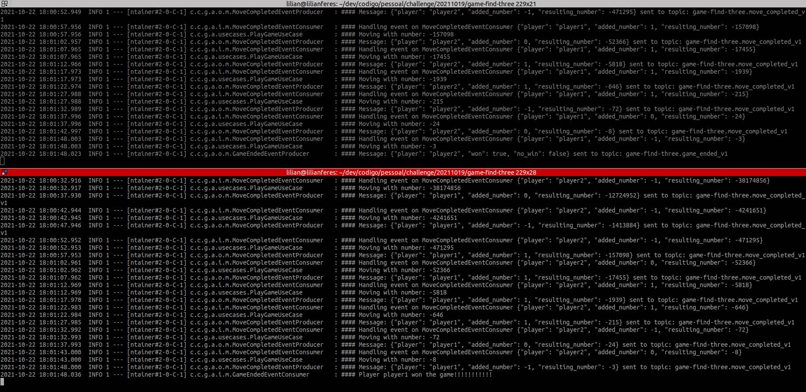
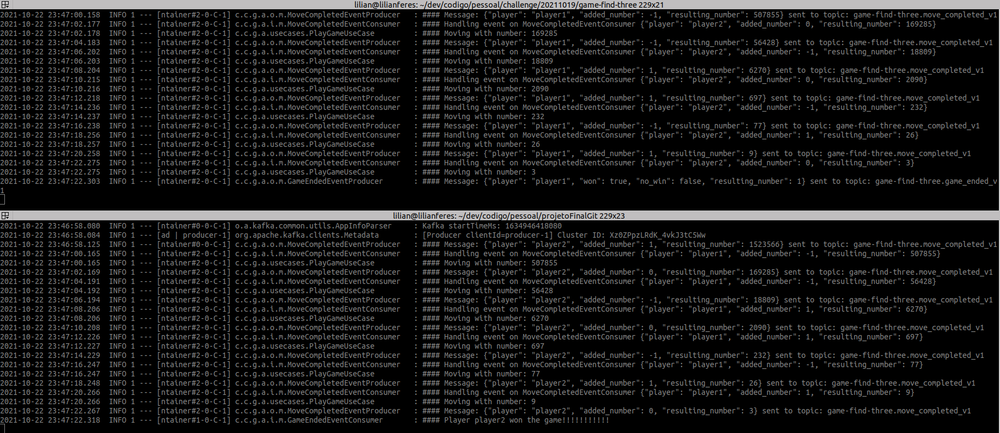

# Game find three

## Prerequisites

* **[Required]** [Java JDK 11+](https://www.oracle.com/java/technologies/javase-jdk11-downloads.html)
* **[Required]** [Gradle 7+](https://gradle.org/install/)
* **[Optional]** [Jetbrains IntelliJ IDEA](https://www.jetbrains.com/idea/download/#section=linux)

## About the stack and concepts

- Language: [Kotlin](https://kotlinlang.org/)
- Framework: [Spring](https://spring.io/)
- Containerization: [Docker](https://www.docker.com/) | [Dockerhub repository](https://hub.docker.com/repository/docker/lilianferesl/gamefindthree/tags?page=1&ordering=last_updated)
- System architecture: Hexagonal Architecture
- Communication between players: Messaging. For development purposes was used  [lensesio/fast-data-dev](https://github.com/lensesio/fast-data-dev)
  - [Link](http://localhost:3030/) to see the [Kafka](https://kafka.apache.org/) Development Environment UI: http://localhost:3030/

## How to execute

Makefile has some targets to facilitate the game execution.

### Automatic mode

To start the game on automatic mode, follow the steps above:

1- Start event platform if it is not up yet:

  `$ make start-event-platform`

2- Start the containers related to players:

  `$ make start-auto-game-environment`

PS: After the end of game on automatic mode, you can start again manually using one of the follow commands:

  `$ make start-manually-by-player1`

  or 

  `$ make start-manually-by-player2`

### Manual mode

To start the game on manual mode, follow the steps above:

1- If the automatic mode is running, stop that:

  `$ make stop-auto-game-environment`

2- Start event platform if it is not up yet:

  `$ make start-event-platform`

3- Start the containers related to players:

  `$ make start-manual-game-environment`

4- To start the game:

  `$ make start-manually-by-player1`

or

  `$ make start-manually-by-player2`

## Logs

1- List containers:
  
  `$ docker ps`

2- Get the "CONTAINER ID" of the container you want follow logs.

3- Follow the container's logs:

  `$ docker logs -f $CONTAINER ID`

PS: Was added a `Thread.sleep(2000)` before sending a MoveCompletedEvent to topic to allow follow the log in a better way.

## Improvements to do

- Negative flows treatment
- More tests implementations
- Store events in database
- Add Github pipeline
- Log centralization. 
  - PS: The current logs have the prefix "#####" to facilitate reading by console. After centralization, this prefix can be removed. 

## Evidences

### player1 won the game 

### player2 won the game

